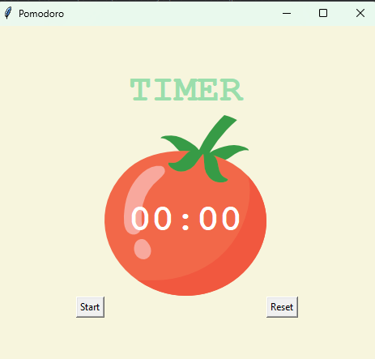

# Pompdoro-Python-Project
A simple and effective **Pomodoro Timer** built using **Python** and **Tkinter**, designed to help boost productivity and manage study sessions efficiently.

## Features:
- 25-minute focus sessions followed by 5-minute short breaks.
- A 20-minute long break after every 4 focus sessions.
- Easy-to-use interface to track study time effectively.

#### 100 Days of Code
